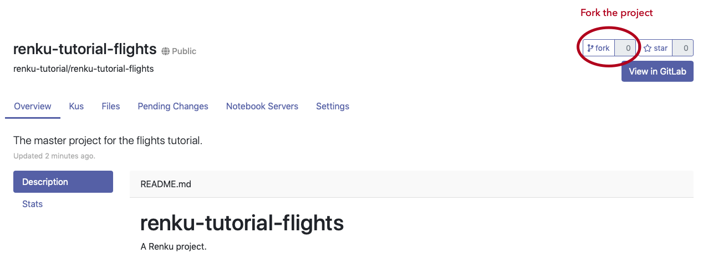
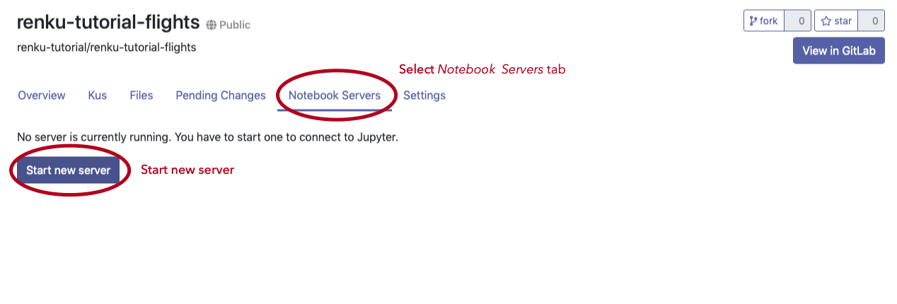
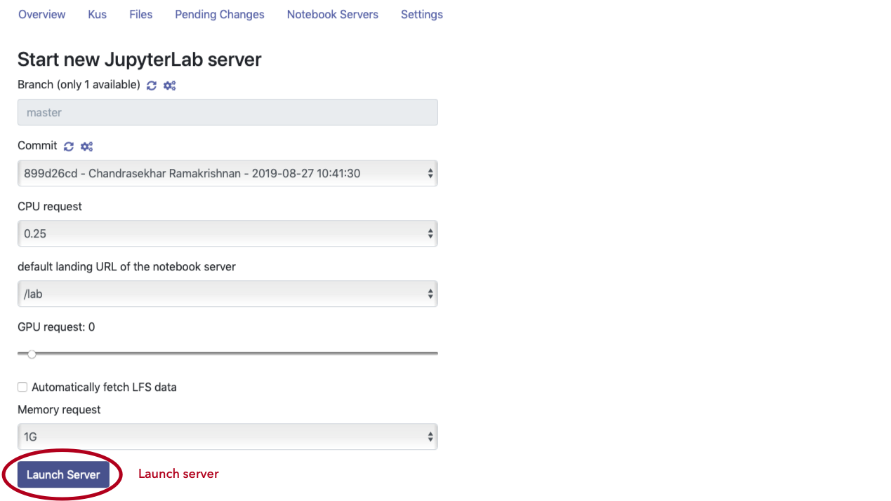
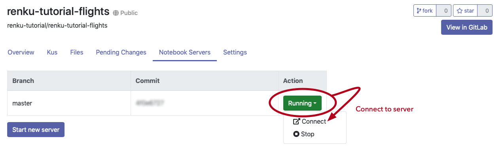
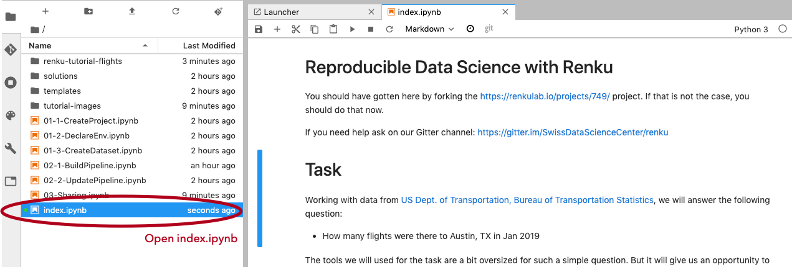

# Starting a Renku project

## Outline

1. **Create repository**
2. Declare environment
3. Import data

# Creating a repository

The first thing to do when starting a project is to initialize a repository. This can be done using the UI. One way to create a repository is to make a new one. Another way is to fork an existing one, which is what we will do first. Let us fork the renku-tutorial-flights repository.

- Log into https://renkulab.io/login
- Navigate to https://renkulab.io/projects/749/
- Fork the project by pressing the `fork` button in the upper right

Let is take a look at what's inside the renku repository

# Working in the repository

To work in the repository, you need to first create an interactive environment (notebook server). So let us do that.

## Step 1: Start a new notebook server

## Step 2: Select options and launch server

Take the default options and select `Launch Server`.

## Step 3: Connect to server

Connect to the server from the `Running>Connect` contextual menu.

# Viewing contents of repository

The remainder of the tutorial runs on the hosted platform. You should go to the notebook `index.ipynb` and follow the tutorial from there.

